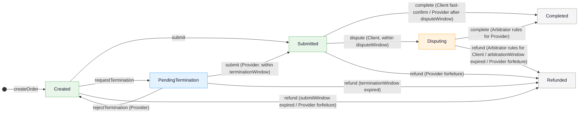
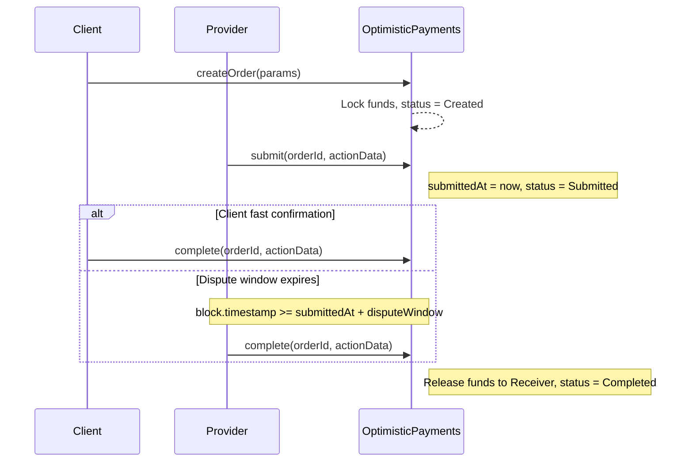
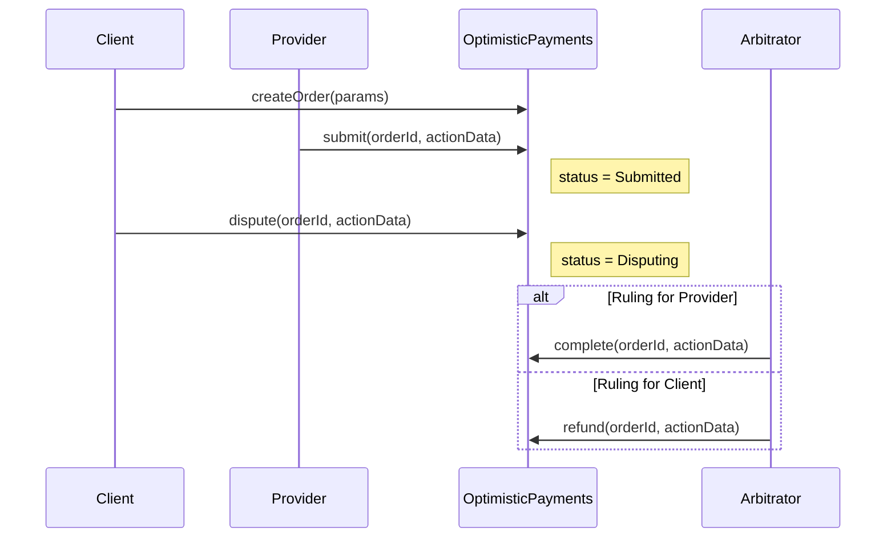
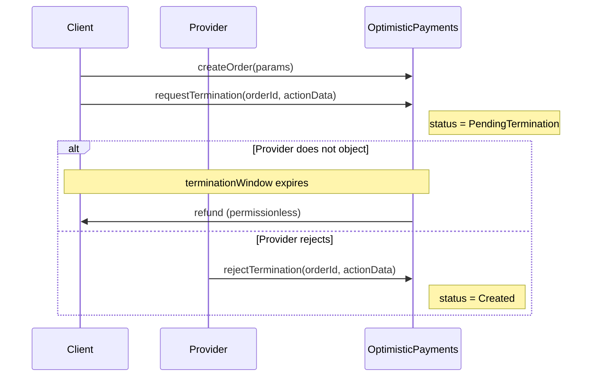
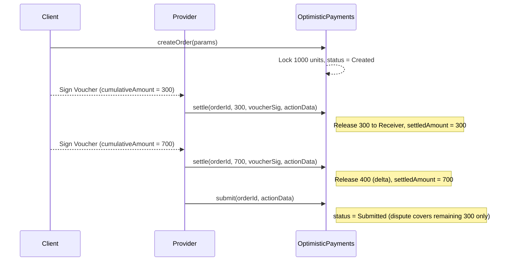

## Abstract

This proposal defines `IOptimisticEscrow`, an interface for on-chain escrow with optimistic settlement. A Client locks funds naming a Provider, and settlement follows one of two paths: on the common path, silence after a bounded dispute window releases funds to a Receiver — which MAY differ from the Provider, enabling marketplace treasury routing; on the exception path, the Client MAY dispute within the window and a pre-designated Arbitrator (EOA or contract) rules. The model supports bilateral termination: the Client may request cancellation, and the Provider may object within a grace period. Long-running engagements MAY settle incrementally via [EIP-712](./eip-712.md) signed cumulative Vouchers. An optional `IEscrowHook` exposes synchronous on-chain callbacks for fee routing and pre-creation validation. The standard covers only the payment and settlement layer and is deliberately decoupled from task scheduling and service discovery, enabling reuse across marketplaces, direct agent-to-agent engagements, and general-purpose escrow.

## Motivation

Escrow with optimistic release is a tried and tested pattern in commerce. The buyer commits funds before delivery, the seller performs within a bounded window, and silence within a challenge period releases funds by default. Disputes are resolved by a platform — a bank, an escrow agent, a marketplace — only on the exception path.

Autonomous agents transact and exchange services in much the same way, but cannot rely on the scaffolding that supports human commerce: reputation is thin, social proof does not translate, and legal recourse is absent. The guarantees must come from the protocol itself — funds locked before work, time-bounded disputes enforced on-chain, and deterministic settlement that does not depend on any single party's cooperation.

Existing standards do not provide this primitive. [ERC-8004](./eip-8004.md) (Trustless Agents) covers identity, reputation, and validation registries, but is explicitly not a settlement layer. Payment channels and streaming payments enable incremental settlement between counterparties, but bind them for the channel lifetime and have no notion of a submitted deliverable or a bounded dispute window.

This proposal extracts the escrow-with-optimistic-release pattern into a standalone, task-agnostic interface and adds EIP-712 cumulative Vouchers for milestone settlement. The Arbitrator role is typed as an `address`, allowing integrators to resolve Arbitrator identity or reputation against independent registries such as ERC-8004 without this standard depending on them.

## Specification

The key words "MUST", "MUST NOT", "REQUIRED", "SHALL", "SHALL NOT", "SHOULD", "SHOULD NOT", "RECOMMENDED", "NOT RECOMMENDED", "MAY", and "OPTIONAL" in this document are to be interpreted as described in RFC 2119 and RFC 8174.

A compliant implementation SHALL implement the `IOptimisticEscrow` interface. A compliant escrow hook SHALL implement the `IEscrowHook` interface. The behavioral requirements below define normative obligations; each function specifies preconditions, state mutations, and events that a compliant contract SHALL enforce.

### Roles

| Role           | Description                                                   | Constraints                                                           |
| -------------- | ------------------------------------------------------------- | --------------------------------------------------------------------- |
| **Client**     | Creates the order and locks funds                             | Set at creation (`msg.sender`); MUST NOT equal Provider or Arbitrator |
| **Provider**   | Executes the task and submits deliverables                    | Set at creation; MUST NOT equal Client or Arbitrator                  |
| **Receiver**   | Actual fund recipient (e.g., a marketplace treasury)          | MAY differ from Provider; defaults to Provider if zero                |
| **Arbitrator** | Independent party (EOA or contract) that adjudicates disputes | Set at creation; MUST NOT equal Client or Provider                    |

### State Machine

An order has exactly one of six states.

| State                | Description                                                                                                                                                                                           |
| -------------------- | ----------------------------------------------------------------------------------------------------------------------------------------------------------------------------------------------------- |
| `Created`            | Order exists, funds locked. Provider MAY `submit`. Client MAY `requestTermination`. Provider MAY redeem Client-signed Vouchers via `settle`.                                                          |
| `Submitted`          | Provider has delivered work. Client MAY `complete` or `dispute` within `disputeWindow`. Provider MAY self-complete after `disputeWindow` expires.                                                     |
| `Disputing`          | Client has challenged the delivered work. Arbitrator MAY `complete` (Provider wins) or `refund` (Client wins). Provider MAY `refund`.                                                                 |
| `PendingTermination` | Client has requested early termination. Within `terminationWindow` the Provider MAY `rejectTermination` to revert to `Created`, MAY `submit` to deliver immediately and advance to `Submitted`, or MAY redeem Client-signed Vouchers via `settle`. |
| `Completed`          | Release remaining funds to the Provider.                                                                                                                                                              |
| `Refunded`           | Remaining funds returned to Client. Already-settled amounts are retained by Receiver.                                                                                                                 |


#### Time Parameters

Each window is measured from the timestamp when its state was entered and independently bounds how long that state can persist. All windows are set in `CreateOrderParams` and are immutable after order creation.

| Parameter           | Type     | Base Timestamp           | Meaning                                                                                 |
| ------------------- | -------- | ------------------------ | --------------------------------------------------------------------------------------- |
| `submitWindow`      | `uint64` | `createdAt`              | Provider MUST `submit` before expiry. After expiry, anyone MAY `refund`.                |
| `disputeWindow`     | `uint64` | `submittedAt`            | Client MAY `dispute` within this period. After expiry, Provider MAY self-complete.      |
| `arbitrationWindow` | `uint64` | `disputedAt`             | Arbitrator MUST rule before expiry. After expiry, anyone MAY `refund`.                  |
| `terminationWindow` | `uint64` | `terminationRequestedAt` | Provider MAY `rejectTermination` within this period. After expiry, anyone MAY `refund`. |

#### State Transitions



### Data Structures

The native asset is represented by the [ERC-7528](./eip-7528.md) sentinel address:

```solidity
address constant NATIVE = 0xEeeeeEeeeEeEeeEeEeEeeEEEeeeeEeeeeeeeEEeE;
```

Anywhere `token` appears below, `token == NATIVE` denotes the native asset of the execution chain.

#### Order

```solidity
struct Order {
    OrderStatus status;

    // Participants
    address client;
    address provider;
    address receiver;

    // Arbitration
    address arbitrator;

    // Hook (non-custodial)
    address hook;

    // Funds
    address token;          // NATIVE sentinel denotes the native asset (see above)
    uint256 amount;
    uint256 settledAmount;

    // Timestamps (recorded when each state is entered)
    uint64  createdAt;
    uint64  submittedAt;
    uint64  disputedAt;
    uint64  terminationRequestedAt;

    // Windows (durations, measured from corresponding timestamp)
    uint64  submitWindow;
    uint64  disputeWindow;
    uint64  arbitrationWindow;
    uint64  terminationWindow;
}

enum OrderStatus {
    Created,
    Submitted,
    Disputing,
    PendingTermination,
    Completed,
    Refunded
}
```

#### CreateOrderParams

```solidity
struct CreateOrderParams {
    address provider;
    address receiver;          // If zero, Receiver defaults to provider.
    address arbitrator;
    address token;             // NATIVE sentinel for the native asset.
    uint256 amount;
    uint64  submitWindow;
    uint64  disputeWindow;
    uint64  arbitrationWindow;
    uint64  terminationWindow;
    address hook;              // address(0) if no hook.
    bytes   hookData;
    bytes32 salt;              // Caller-supplied entropy for orderId derivation.
}
```

#### Settlement Voucher (EIP-712)

```solidity
// TypeHash: keccak256("Voucher(bytes32 orderId,uint256 cumulativeAmount)")
struct Voucher {
    bytes32 orderId;
    uint256 cumulativeAmount;
}
```

Adapted from Tempo's Machine Payments Protocol (cumulative-voucher design in `TempoStreamChannel`). This specification extends that pattern to cover two settlement modes under a single escrowed order:

- **Milestone payments** — discrete phases acknowledged on completion.
- **Payment-channel sessions** — continuous-use metered as a running total.

The Voucher is bound to an `orderId` and `settle` is gated by the order state machine.

Each Voucher represents a cumulative claim that supersedes all prior Vouchers for the same order. `cumulativeAmount` is monotonically increasing: a compliant implementation MUST verify `cumulativeAmount > order.settledAmount`, which eliminates the need for a nonce mapping and makes replay of an old Voucher impossible (`settledAmount` has already advanced past its value). Cross-chain and cross-contract replay is prevented by the EIP-712 domain separator (`chainId` + `verifyingContract`).

### Core Interface

#### Operations Summary

| Operation            | Who Calls                      | From State                       | To State             | Effect                                    |
| -------------------- | ------------------------------ | -------------------------------- | -------------------- | ----------------------------------------- |
| `createOrder`        | Client                         | —                                | `Created`            | Lock funds in escrow                      |
| `submit`             | Provider                       | `Created` / `PendingTermination` | `Submitted`          | Record deliverable, start dispute window  |
| `complete`           | Client / Provider / Arbitrator | `Submitted` / `Disputing`        | `Completed`          | Release remaining funds to Receiver       |
| `dispute`            | Client                         | `Submitted`                      | `Disputing`          | Challenge delivery within dispute window  |
| `settle`             | Provider                       | `Created` / `PendingTermination` | *(unchanged)*        | Redeem Voucher, release delta to Receiver |
| `requestTermination` | Client                         | `Created`                        | `PendingTermination` | Start termination grace period            |
| `rejectTermination`  | Provider                       | `PendingTermination`             | `Created`            | Object to termination, resume work        |
| `refund`             | Anyone (after window expiry) / Arbitrator / Provider | `Created` / `Submitted` / `Disputing` / `PendingTermination` | `Refunded` | Return remaining funds to Client |

#### Interface

```solidity
interface IOptimisticEscrow {
    // Events
    event OrderCreated(bytes32 indexed orderId, address indexed client, address indexed provider, uint256 amount);
    event Submitted(bytes32 indexed orderId);
    event Settled(bytes32 indexed orderId, uint256 cumulativeAmount, uint256 delta);
    event Disputed(bytes32 indexed orderId);
    event Completed(bytes32 indexed orderId, address indexed operator);
    event Refunded(bytes32 indexed orderId, address indexed operator);
    event TerminationRequested(bytes32 indexed orderId);
    event TerminationRejected(bytes32 indexed orderId);

    // Create
    /// @notice Create an order and lock funds.
    function createOrder(CreateOrderParams calldata params) external payable returns (bytes32 orderId);

    // Submission
    /// @notice Provider submits deliverable.
    /// @dev Callable when status is `Created` or `PendingTermination`.
    ///      When status is `PendingTermination`, SHALL additionally require
    ///      `block.timestamp < terminationRequestedAt + terminationWindow`.
    ///      A submission from `PendingTermination` transitions directly to `Submitted`,
    ///      overriding the pending termination request.
    function submit(bytes32 orderId, bytes calldata actionData) external;

    // Completion
    /// @notice Complete the order and release the remaining balance to Receiver.
    function complete(bytes32 orderId, bytes calldata actionData) external;

    // Dispute
    /// @notice Client disputes Provider's submitted delivery.
    function dispute(bytes32 orderId, bytes calldata actionData) external;

    // Incremental Settlement
    /// @notice Provider redeems a Client-signed Voucher for incremental settlement.
    function settle(
        bytes32 orderId,
        uint256 cumulativeAmount,
        bytes calldata voucherSig,
        bytes calldata actionData
    ) external;

    // Termination
    /// @notice Client requests early termination.
    function requestTermination(bytes32 orderId, bytes calldata actionData) external;

    /// @notice Provider rejects a termination request.
    function rejectTermination(bytes32 orderId, bytes calldata actionData) external;

    // Refund
    /// @notice Refund (amount - settledAmount) to Client.
    function refund(bytes32 orderId, bytes calldata actionData) external;

    // View
    /// @notice Returns the full Order struct for a given orderId.
    function getOrder(bytes32 orderId) external view returns (Order memory);
}
```

### Hooks

Implementations MAY support an optional `IEscrowHook` per order, allowing integrators to attach custom logic such as policy checks, allowlists, fee routing, or external state updates. If `hook == address(0)`, the core SHALL skip all hook calls.

```solidity
interface IEscrowHook {
    /// @notice Called before each core operation. MAY revert to block the operation.
    function beforeAction(bytes32 orderId, bytes4 selector, bytes calldata data) external;

    /// @notice Called after each core operation. Revert rolls back the entire transaction.
    function afterAction(bytes32 orderId, bytes4 selector, bytes calldata data) external;
}
```

Both callbacks fire on every core operation — `createOrder`, `submit`, `complete`, `dispute`, `settle`, `requestTermination`, `rejectTermination`, and `refund`. `beforeAction` runs before the core logic applies state changes; reverting blocks the operation. `afterAction` runs synchronously after state changes and fund transfers, within the same transaction; reverting rolls the entire transaction back. `selector` identifies the triggering operation. `data` is opaque to the core: `hookData` from `CreateOrderParams` is passed when `selector == createOrder.selector`; for all other operations, the core function's `actionData` is passed.

### Flows

These diagrams are non-normative.

#### Happy Path



#### Dispute Path



#### Termination Path



#### Incremental Settlement



## Rationale
*   **Optimistic settlement:** Most engagements complete without dispute. If arbitration were on the release path of every order, every order would pay for it — in gas, latency, and any Arbitrator fee — whether or not it was needed. Optimistic settlement makes arbitration opt-in: the default is release after a silent dispute window, and the cost of invoking an Arbitrator falls on the party that calls `dispute`, only when they do. This mirrors the trade used by optimistic rollups and UMA's optimistic oracle — accept the asserted outcome after a challenge period unless someone pays to contest it.
*   **Cumulative Vouchers:** Each Voucher carries the running total owed, so the Provider redeems only the latest on-chain to claim everything acknowledged so far. Older Vouchers become unredeemable automatically because `settledAmount` has already advanced past their value, so no nonce tracking is required.
*   **Windows, not absolute deadlines:** An order's transition times are not knowable at creation, so only a window (a duration measured from state entry) can give each actor a fixed budget. An absolute deadline set at creation cannot — a late submission would shrink the Client's dispute budget one-for-one.
*   **Arbitrator typed as `address`:** Any address can serve as Arbitrator — an EOA, a multisig, a staked contract, or a reputation-backed service (e.g. [ERC-8004](./eip-8004.md)). The only enforced constraint is `arbitrator != client` and `arbitrator != provider`, ruling out self-dealing; everything else is an integrator choice.
*   **`submit` from `PendingTermination`:** If `submit` were only callable from `Created`, a Client could grief the Provider by racing to `requestTermination` every time the Provider rejected termination, bouncing the order between `Created` and `PendingTermination` until `submitWindow` expired. Allowing the Provider to `submit` directly from `PendingTermination` (within `terminationWindow`) collapses the bounce loop in one Provider transaction: the Provider may choose to reject termination and continue working, or submit and advance straight to `Submitted` where the Client's legitimate recourse is `dispute`. Gating by both `submitWindow` and `terminationWindow` preserves the invariant that nothing happens in `PendingTermination` after `terminationWindow` except refund.

## Backwards Compatibility

This proposal is purely additive and introduces no changes to existing standards. Compliant implementations work with any [ERC-20](./eip-20.md) token and with the native asset.

## Security Considerations

*   **Non-reversibility of settled amounts:** Once a Voucher is redeemed via `settle`, the released amount is final. Disputes cover only `amount - settledAmount`; a Client who settles 700 of 1000 via Vouchers and then disputes can recover at most 300. Clients SHOULD issue Vouchers only for confirmed, satisfactory partial work.
*   **Arbitrator trust:** During `Disputing`, the Arbitrator can call `complete` (release to Provider) or `refund` (return to Client). The contract enforces `arbitrator != client` and `arbitrator != provider` but cannot guarantee Arbitrator competence or honesty. For high-value orders, Arbitrators SHOULD be staked or reputation-backed (e.g. via [ERC-8004](./eip-8004.md)).
*   **Hook trust and liveness:** Hooks fire on every core operation — including `refund` — so a malicious or buggy hook that reverts can permanently lock escrowed funds. Before setting a hook, integrators SHOULD consider:
    *   **Audit.** Both Client and Provider SHOULD independently verify the hook contract. Hooks are not whitelisted by the standard.
    *   **No escape hatch.** A reverting hook blocks every release path, including the permissionless timeout-based refunds (`submitWindow` / `arbitrationWindow` / `terminationWindow` expiry).
    *   **Upgradeability.** Hooks SHOULD NOT be upgradeable after order creation; otherwise a previously-safe hook could change behaviour mid-order.
    *   **Allowlist or registry.** Implementations MAY maintain a registry of vetted hooks to reduce per-order due diligence.
*   **Hook gas limits:** Implementations SHOULD impose a gas limit on hook calls (e.g. `call{gas: HOOK_GAS_LIMIT}(...)`) to bound execution cost and prevent hooks from consuming unbounded gas. The specific limit is left to the implementation as gas costs vary across chains.
*   **Reentrancy:** Functions that transfer funds SHALL follow the checks-effects-interactions pattern and SHOULD be protected by a reentrancy guard. Native-asset transfers use low-level `call`.
*   **Tokens:** ERC-20 transfers SHOULD use SafeERC-20 or an equivalent helper that tolerates non-compliant (missing-return-value) [ERC-20](./eip-20.md) tokens.
*   **Window selection:** Implementations enforce window durations but do not constrain their values. Very short windows risk unfair expiry (e.g. a Provider cannot submit in time); very long windows lock Client capital. Note that `submitWindow` is measured from `createdAt` and continues to tick during `PendingTermination` — it is not paused when a termination is requested. Integrators SHOULD therefore set `terminationWindow` strictly less than `submitWindow` so that a rejected termination leaves the Provider adequate time to submit.
*   **Smart-account Voucher validity:** When the Client is a smart contract account (e.g. [ERC-1271](./eip-1271.md), [ERC-4337](./eip-4337.md)), Voucher signature validity is decided at redemption time by the account's current on-chain state, not by the signature alone. The Client can revoke the signing key or session authorization that produced a Voucher, causing a subsequent `settle` call to revert even though the signature was valid when the Provider received it. Providers SHOULD redeem Vouchers promptly rather than holding them, and SHOULD treat smart-account authorization changes as an invalidation risk distinct from on-chain window expiry.

## Copyright

Copyright and related rights waived via [CC0](../LICENSE).
